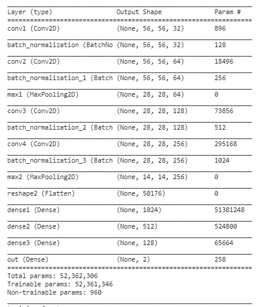

# CMPT 764 - Final Project Scorer

The scorer is trained using positive and negative data generated from the mixer. 
The training is done in Scorer.ipynb. 
The generated chairs from mixer then get fed into Scorer_inference.ipynb to be sorted based on their score. 

## Data

Because the positive and negative data given to us to train the scorer were uneven, the scorer model could not be trained well.
To overcome this issue, we generated our own dataset. In order to do so, we used mixer to generate both positive and negative samples evenly.

Both positive and negative samples are RGB, jpg files with 224*224 resulotion. 

## Data Loader

The data is devided into 3 groups (top, side and front) using their naming scheme. Then they are resized from 224*224 to 56*56 to accomodate our computational resources. 
Each positive and negative data are labeled with [1,0] and [0,1] respectively.

Then the data is shuffled and devided into train and test sets with same porportion of negative and positve samples.

## Network 

We use a Convolutional Deep Neural Network to train the scorer classifier. We input an 56*56*3 image  to 4 convolutional layers followed by a BatchNormalization layer after each Convolutional layer and a MaxPool layer after each 2 convolutional layers. At the tend we have four Dense layers with 2 neuron output to show the probablity of the image being positive or negative.
Here is the network architecture:

Then the network is trained using Adam optimizer and Categorical Cross Entropy loss for each set of images (top,side,front).

The validation accuracy average for all the networks is close to 90%.

## Checkpoints 
Please find the check points in the following google drive links:

* [Top Model checkpoint](https://drive.google.com/file/d/1ieVpYHhh57YFdfXiGHAWLzl4EyWhmCvJ/view?usp=sharing)
* [Front Model checkpoint](https://drive.google.com/file/d/1iemtjIo2CLmxjuCzpAOCn-gTlAfOPAwr/view?usp=sharing)
* [Side Model checkpoint](https://drive.google.com/file/d/1ieiAGlevSSMmbn4wMWJtTIMfv-51zJdW/view?usp=sharing)
